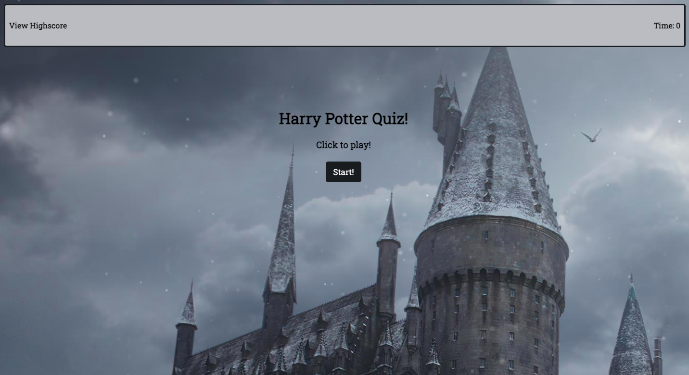
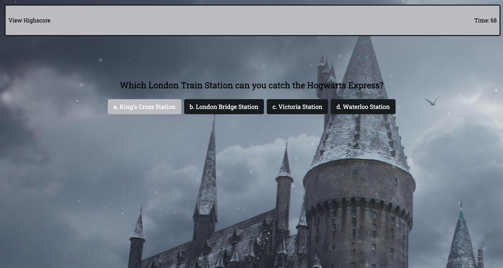
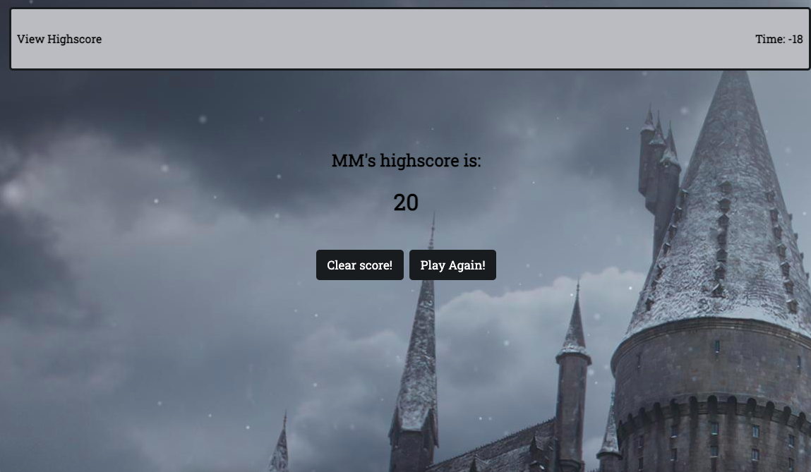
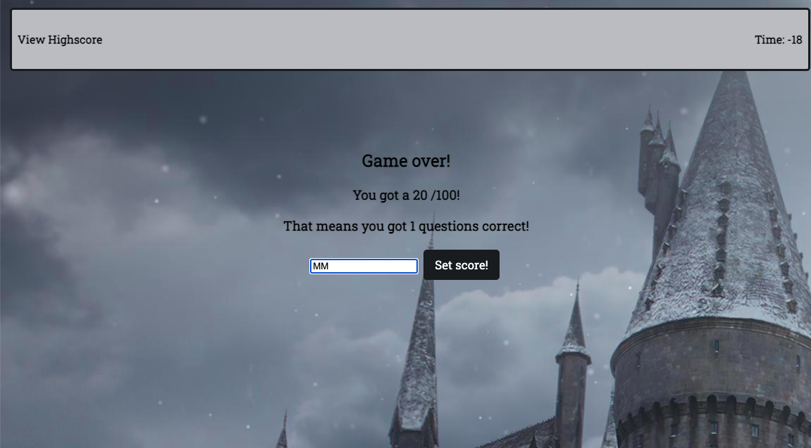

# Code-Quiz
University of Minnesota - Coding Bootcamp Homework 4
## User Story
AS A coding boot camp student
I WANT to take a timed quiz on JavaScript fundamentals that stores high scores
SO THAT I can gauge my progress compared to my peers
## Acceptance Criteria
GIVEN I am taking a code quiz
WHEN I click the start button
THEN a timer starts and I am presented with a question
WHEN I answer a question
THEN I am presented with another question
WHEN I answer a question incorrectly
THEN time is subtracted from the clock
WHEN all questions are answered or the timer reaches 0
THEN the game is over
WHEN the game is over
THEN I can save my initials and score

# Description
This is a timer-based trivia quiz using HTML, CSS and JavaScript. This is a multiple choice question quiz with the theme being Harry Potter. Once you click start, the timer will begin and take you to a series of 10 questions. If answered correctly you will get points and time added to your timer. If answered incorrectly you will lose points and time. 

At the end of the quiz you will be able to see your score and enter your intials to save your highscore. 

# Demo
### Start Game

### Clicking Through Quiz

### Setting Your High Score

### Game Over

# Deployed Site
https://mollymontgomery.github.io/Code-Quiz/ 